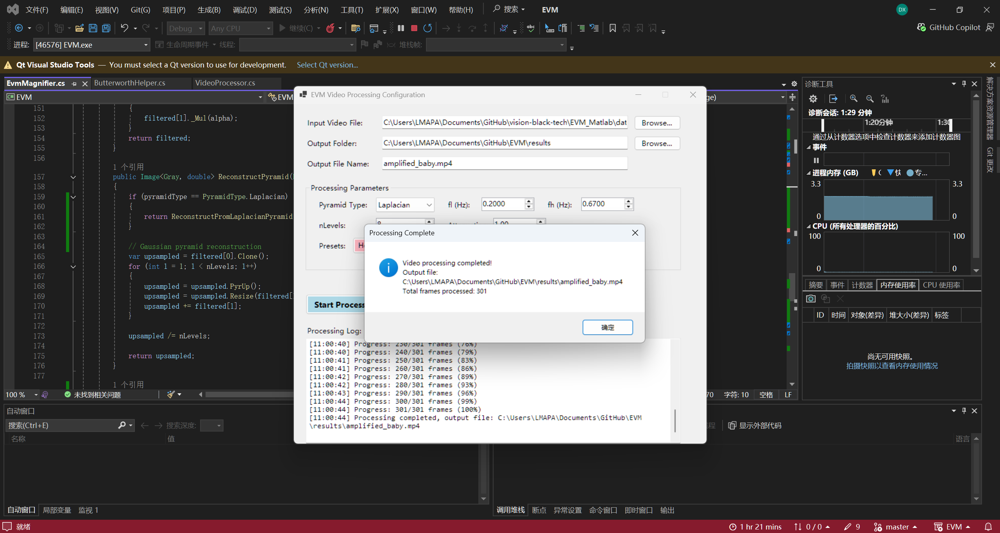

# Eulerian Video Magnification 🎥🔍

A C# implementation of [Eulerian Video Magnification](https://people.csail.mit.edu/mrub/evm/) (SIGGRAPH 2012). Reveal hidden motions and color changes in videos that your eyes can't see!

## Dev Insights 💡

**Motion Artifacts = Pain**
If the person moves their head, everything goes wild. Future plan: slap YOLO on this to detect/segment the face and stabilize the ROI. PRs welcome if you wanna help!

**Why EVM is Cool**
This algorithm is *elegant*. Like, surprisingly simple but effective. It's still the fastest approach in the Video Magnification world (unless someone figures out how to make Mamba work here 👀).

**The Filter Dilemma**
The original paper uses three kinds of filters, ideal, simple IIR, and Butterworth. For real-time processing, we went with Butterworth.
We tried IIR first but it was not interpretable 🙃. Switched to Butterworth and the results got way cleaner, though there's a tiny bit of delay.

> The values of `r1, r2` in IIR reflect the confidence of the present and past signal. To induce a valid `r1, r2`, it seems to relate to `r = 2*pi*Fc/Fs`, and the algorithm constrains its range in [0, 1]. In the MATLAB code, the `baby` and `wrist` cases use r1=0.4 and r2=0.05, which means Fc1≈0.4*30/(2*pi)=**1.91Hz** (~114 BPM) and Fc2≈0.05*30/(2*pi)=**0.24Hz** (~14 BPM).
>
> The annoying part? You can't just say "give me 0.5-2 Hz"—you have to do math backwards to get these magic `r` values. 

## The One Cool Thing We Added

MathNet.Filtering doesn't let you configure filters like MATLAB's `butter()` (seriously, why??). So we wrote [`ButterworthHelper.cs`](EVM/ButterworthHelper.cs) to compute IIR coefficients directly from cutoff frequency + sampling rate. 

Currently only first-order. Higher orders = PR welcome 🙏

## TODO 

- [] Implement the lambda parameter (λ) from the paper. It helps to reduce noise for Laplacian pyramid.

## Quick Start

1. Open in Visual Studio
2. Click Run ▶️
3. Load a video
4. Adjust sliders
5. Watch the magic happen ✨

**Requirements:** .NET 8.0 + Windows

## References

- Original Paper: [Eulerian Video Magnification for Revealing Subtle Changes in the World](https://people.csail.mit.edu/mrub/evm/) (Wu et al., SIGGRAPH 2012)

## 2026+ Update 📅

Still interested in video-based vital signs? EVM is cool but if you're specifically doing **heart rate / respiration monitoring**, check out the **rPPG** (remote Photoplethysmography) field. Way more mature for that use case.

Recommendation: [rppg-toolbox](https://github.com/ubicomplab/rPPG-Toolbox) - way better accuracy for pulse detection.

---

*Contributors welcome! Especially if you know signal processing better than me.*
